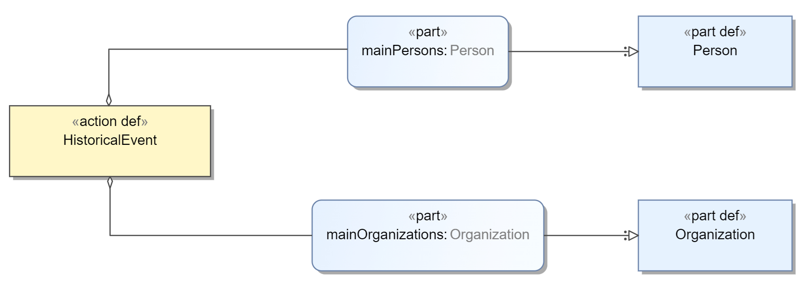
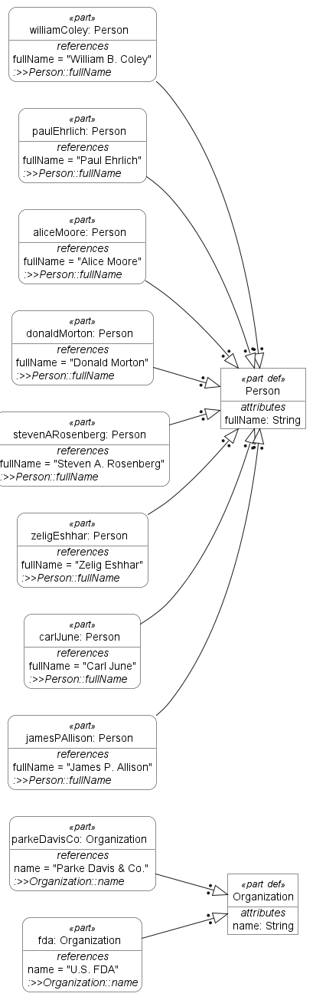
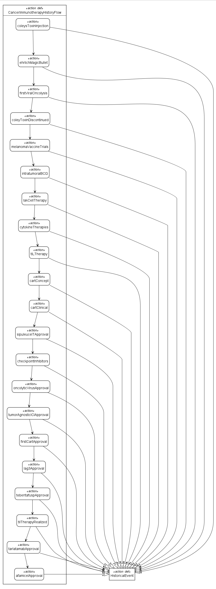

# Cancer Immunotherapy from a Systems Engineering Perspective: SysML v2 Modeling Examples for Domain Experts

**Author:** FagaoMBSE

**Last Updated:** December 7, 2025

## Preface

With the advent of the AI era, scientific researchers and product
developers have the opportunity to free themselves from trivial
auxiliary tasks. Researchers with ambition but limited auxiliary
resources now have the chance to join the competitive landscape of
research. The focus of this competition is increasingly shifting toward
the researcher's ability to clearly define the logic of problems and
solutions. Formal modeling will provide researchers with a significant
advantage in leveraging AI.

This book takes Cancer Immunotherapy—a current hotspot in research—as a
case study to demonstrate modeling examples in this field. It explores
the feasibility of domain experts mastering modeling skills and leading
the modeling process.

Currently, Systems Biology and Computational Biology have established
widely accepted and used modeling standards, such as the graphical
representation SBGN, and text specifications like SBML and CellML,
accumulating a rich repository of models.

This book approaches the subject from the perspective of "Cross-Level
Unification" Starting from the microscopic biological level (molecules,
cells, tissues, organs, individuals) to the macroscopic healthcare
system level (personnel, equipment, institutions), we use the Systems
Modeling Language (SysML) developed by the OMG to model knowledge at
each level related to cancer immunotherapy, with the goal of creating
executable or simulation-ready “living” models that are
reusable—researchers can apply them across multiple research projects.

### Target Audience

This book is intended for professionals in tumor immunotherapy and
related fields, including:

⦁ Clinical medical experts and oncologists

⦁ Basic and translational medicine researchers

⦁ R\&D personnel in the pharmaceutical industry and biotechnology sectors

⦁ Systems engineering and software engineering practitioners developing
related systems

### How to Read This Book

Chapter 1 covers the basic modeling knowledge of SysML v2. Even if
readers have no prior knowledge of Systems Engineering/Software
Engineering or SysML/UML, they can proceed to subsequent chapters after
carefully reading Chapter 1. Of course, if readers are not satisfied
with the content of Chapter 1, they may supplement their learning with
any recommended books or video tutorials.

From Chapter 2 onwards, the book enters the practical phase of modeling.
Advanced modeling knowledge not covered in Chapter 1 will be introduced
as needed, tailored to the specific model content.

### Tools and Specifications

At the time of writing, the referenced SysML version is the 2.0
Specification released on September 3, 2025. The graphical rendering
tools used are Eclipse Modeling Tools and M-Design v2. As more modeling
tools become available on the market, the graphical rendering tools may
change in the subsequent writing process.

### Publication Format

This book is currently being released in a serialized format, with new
installments first appearing on https://github.com/FagaoMBSE.

### Feedback

Your feedback is welcome. The author can be reached at:
fagaombse@gmail.com.

## Chapter 2: History of Cancer Immunotherapy

This chapter uses SysML v2 \[1] to model the developmental history of
cancer immunotherapy. The primary references are the SITC textbook
Cancer Immunotherapy Principles and Practice (2nd Edition) \[2],
combined with relevant regulatory milestones published by the FDA
between 2017–2025 \[3-10].

When modeling, the focus is primarily on historical events that produced
practical results. Therefore, some newsworthy events, such as the
awarding of Nobel Prizes in Physiology or Medicine related to cancer
immunotherapy, may not be included in the modeled event list.

### 2.1 SysML v2 Textual Representation

In this chapter, we unify historical events by modeling them as
`HistoricalEvent`, referencing key figures and institutions through
`mainPersons` and `mainOrganization`.

In the `CancerImmunotherapyHistoryFlow`, a linear `first ... then ...` structure is adopted to approximate the ordering of historical
events. In the actual historical process, different research paths often
advance in parallel and intersect. This simplification will be corrected
in subsequent chapters through more precise time modeling.

The SysML v2 text is shown in Listing 2-1.

**package** CancerImmunotherapyHistory {

**private** **import** ScalarValues::String;

**part** **def** Person {

**attribute** fullName : String;

}

**part** **def** Organization {

**attribute** name : String;

}

**action** **def** HistoricalEvent {

**attribute** year : String;

**attribute** titleEn : String;

**attribute** summaryEn : String;

**ref** **part** mainPersons\[0..\*] : Person;

**ref** **part** mainOrganizations\[0..\*] : Organization;

}

**part** williamColey : Person {

:>> fullName = "William B. Coley";

}

**part** paulEhrlich : Person {

:>> fullName = "Paul Ehrlich";

}

**part** aliceMoore : Person {

:>> fullName = "Alice Moore";

}

**part** donaldMorton : Person {

:>> fullName = "Donald Morton";

}

**part** stevenARosenberg : Person {

:>> fullName = "Steven A. Rosenberg";

}

**part** zeligEshhar : Person {

:>> fullName = "Zelig Eshhar";

}

**part** carlJune : Person {

:>> fullName = "Carl June";

}

**part** jamesPAllison : Person {

:>> fullName = "James P. Allison";

}

**part** parkeDavisCo : Organization {

:>> name = "Parke Davis \& Co.";

}

**part** fda : Organization {

:>> name = "U.S. FDA";

}

**action** **def** CancerImmunotherapyHistoryFlow {

**action** coleysToxinInjection : HistoricalEvent {

:>> year = "1891";

:>> titleEn = "Coley's toxin injection therapy";

:>> summaryEn = "Coley injects bacterial toxins to treat inoperable
sarcomas.";

:>> mainPersons = williamColey;

}

**action** ehrlichMagicBullet : HistoricalEvent {

:>> year = "early 1900s";

:>> titleEn = "Ehrlich's 'Magic Bullet' hypothesis";

:>> summaryEn = "Concept that drugs could selectively target disease
cells without harming normal tissues, providing a conceptual basis for
targeted and immune-based therapies.";

:>> mainPersons = paulEhrlich;

}

**action** firstViralOncolysis : HistoricalEvent {

:>> year = "circa 1949";

:>> titleEn = "First viral oncolysis experiment";

:>> summaryEn = "Clinical and preclinical observations that certain
viral infections could lead to temporary tumor regression, inspiring
oncolytic virus strategies.";

:>> mainPersons = aliceMoore;

}

**action** coleyToxinDiscontinued : HistoricalEvent {

:>> year = "1950s";

:>> titleEn = "Coley's toxin discontinued by Parke Davis";

:>> summaryEn = "Industrial production of Coley toxin was
discontinued, marking the decline of early empirical cancer
immunotherapy approaches.";

:>> mainOrganizations = parkeDavisCo;

}

**action** melanomaVaccineTrials : HistoricalEvent {

:>> year = "1970s–2000s";

:>> titleEn = "Melanoma vaccine clinical trials";

:>> summaryEn = "Multiple melanoma vaccine trials were conducted over
several decades, but most showed limited clinical benefit, highlighting
the difficulty of inducing effective anti-tumor immunity.";

:>> mainPersons = donaldMorton;

}

**action** intratumoralBCG : HistoricalEvent {

:>> year = "1970s";

:>> titleEn = "Intratumoral BCG immunotherapy";

:>> summaryEn = "BCG is injected directly into tumors to stimulate
local immune responses.";

:>> mainPersons = donaldMorton;

}

**action** lakCellTherapy : HistoricalEvent {

:>> year = "1980s";

:>> titleEn = "LAK (lymphokine-activated killer) cell therapy";

:>> summaryEn = "Ex vivo activation of peripheral lymphocytes with
high-dose IL-2 to kill tumors.";

:>> mainPersons = stevenARosenberg;

}

**action** cytokineTherapies : HistoricalEvent {

:>> year = "1980s";

:>> titleEn = "Cytokine therapies with IL-2 and IFN-alpha";

:>> summaryEn = "High-dose IL-2 and interferon-alpha are used as
systemic immunotherapies.";

}

**action** tILTherapy : HistoricalEvent {

:>> year = "1988";

:>> titleEn = "Tumor-infiltrating lymphocyte (TIL) therapy";

:>> summaryEn = "Isolation and expansion of TILs from resected tumors
followed by reinfusion.";

:>> mainPersons = stevenARosenberg;

}

**action** cartConcept : HistoricalEvent {

:>> year = "1990s";

:>> titleEn = "Chimeric antigen receptor T cell (CAR-T) concept";

:>> summaryEn = "First designs of chimeric antigen receptors combined
antibody-derived recognition with T-cell signaling, providing a
framework for genetically engineered T-cell therapies.";

:>> mainPersons = zeligEshhar;

}

**action** cartClinical : HistoricalEvent {

:>> year = "2010s";

:>> titleEn = "Clinical breakthrough of CAR-T cell therapy";

:>> summaryEn = "CD19-targeted CAR-T cell therapies achieved dramatic
remissions in refractory leukemia and lymphoma, leading to regulatory
approvals and establishing CAR-T as a major modality of cancer
immunotherapy.";

:>> mainPersons = carlJune;

}

**action** sipuleucelTApproval : HistoricalEvent {

:>> year = "2010";

:>> titleEn = "Approval of the first therapeutic cancer vaccine
(Sipuleucel-T)";

:>> summaryEn = "Regulatory approval of the autologous cellular
product Sipuleucel-T for metastatic prostate cancer demonstrated that
personalized cancer vaccines could reach the clinic.";

:>> mainOrganizations = fda;

}

**action** checkpointInhibitors : HistoricalEvent {

:>> year = "2011–2014";

:>> titleEn = "Immune checkpoint inhibitor era (CTLA-4, PD-1/PD-L1)";

:>> summaryEn = "Approval of CTLA-4 and PD-1/PD-L1 antibodies
established immune checkpoint blockade as a transformative cancer
treatment, with durable responses across multiple tumor types.";

:>> mainPersons = jamesPAllison;

}

**action** oncolyticVirusApproval : HistoricalEvent {

:>> year = "2015";

:>> titleEn = "Approval of the oncolytic virus T-VEC";

:>> summaryEn = "The approval of the oncolytic herpesvirus Talimogene
laherparepvec (T-VEC) for melanoma provided proof of concept for
genetically engineered oncolytic viruses as a clinical cancer
immunotherapy.";

:>> mainOrganizations = fda;

}

**action** tumorAgnosticICIApproval : HistoricalEvent {

:>> year = "2017";

:>> titleEn = "First tumor-agnostic approval of an immune checkpoint
inhibitor";

:>> summaryEn = "The FDA granted approval to pembrolizumab for solid
tumors with MSI-H or dMMR, regardless of the tissue of origin, marking
the first tumor-agnostic indication for an immune checkpoint
inhibitor.";

:>> mainOrganizations = fda;

}

**action** firstCartApproval : HistoricalEvent {

:>> year = "2017";

:>> titleEn = "First CAR-T therapy approval (Tisagenlecleucel)";

:>> summaryEn = "FDA approved Tisagenlecleucel (Kymriah) for pediatric
acute lymphoblastic leukemia, marking the first regulatory approval of a
gene therapy in the US.";

:>> mainOrganizations = fda;

:>> mainPersons = carlJune;

}

**action** lag3Approval : HistoricalEvent {

:>> year = "2022";

:>> titleEn = "Regulatory approval of a LAG-3–targeted immune
checkpoint inhibitor";

:>> summaryEn = "The FDA approved the combination of relatlimab
(anti-LAG-3) and nivolumab, validating LAG-3 as the third immune
checkpoint pathway for clinical use.";

:>> mainOrganizations = fda;

}

**action** tebentafuspApproval : HistoricalEvent {

:>> year = "2022";

:>> titleEn = "First TCR-based bispecific therapeutic approved
(Tebentafusp)";

:>> summaryEn = "Tebentafusp, a soluble TCR–CD3 bispecific therapeutic
targeting gp100, receives regulatory approval as the first T cell
receptor (TCR)-based anticancer drug, but it is not an adoptive TCR-T
cell therapy.";

:>> mainOrganizations = fda;

}

**action** tilTherapyRealized : HistoricalEvent {

:>> year = "2024";

:>> titleEn = "First TIL therapy approval (Lifileucel)";

:>> summaryEn = "The FDA granted accelerated approval to Lifileucel
for advanced melanoma, making it the first approved tumor-infiltrating
lymphocyte therapy, realizing the long-awaited potential of adoptive
cell transfer for solid tumors.";

:>> mainOrganizations = fda;

}

**action** tarlatamabApproval : HistoricalEvent {

:>> year = "2024";

:>> titleEn = "First DLL3-targeted bispecific antibody (Tarlatamab)";

:>> summaryEn = "FDA granted accelerated approval to tarlatamab for
extensive-stage small cell lung cancer (SCLC). It is the first BiTE
(bispecific T-cell engager) to successfully target a solid tumor antigen
(DLL3) in a major cancer type.";

:>> mainOrganizations = fda;

}

**action** afamicelApproval : HistoricalEvent {

:>> year = "2024";

:>> titleEn = "First TCR-T therapy for solid tumors (Afami-cel)";

:>> summaryEn = "Approval of afamitresgene autoleucel (Afami-cel) for
synovial sarcoma. Unlike CAR-T which targets surface antigens, this
engineered TCR-T therapy targets the intracellular antigen MAGE-A4,
marking a breakthrough for engineered cell therapy in solid tumors.";

:>> mainOrganizations = fda;

}

**first** coleysToxinInjection **then** ehrlichMagicBullet;

**first** ehrlichMagicBullet **then** firstViralOncolysis;

**first** firstViralOncolysis **then** coleyToxinDiscontinued;

**first** coleyToxinDiscontinued **then** melanomaVaccineTrials;

**first** melanomaVaccineTrials **then** intratumoralBCG;

**first** intratumoralBCG **then** lakCellTherapy;

**first** lakCellTherapy **then** cytokineTherapies;

**first** cytokineTherapies **then** tILTherapy;

**first** tILTherapy **then** cartConcept;

**first** cartConcept **then** cartClinical;

**first** cartClinical **then** sipuleucelTApproval;

**first** sipuleucelTApproval **then** checkpointInhibitors;

**first** checkpointInhibitors **then** oncolyticVirusApproval;

**first** oncolyticVirusApproval **then** tumorAgnosticICIApproval;

**first** tumorAgnosticICIApproval **then** firstCartApproval;

**first** firstCartApproval **then** lag3Approval;

**first** lag3Approval **then** tebentafuspApproval;

**first** tebentafuspApproval **then** tilTherapyRealized;

**first** tilTherapyRealized **then** tarlatamabApproval;

**first** tarlatamabApproval **then** afamicelApproval;

}

}

Listing 2-1: SysML v2 Text regarding the History of Cancer Immunotherapy

### 2.2 SysML v2 Graphical Representation

The graphical rendering results of the above SysML v2 text are shown in
Figure 2-1 to Figure 2-3.

Figure 2-1 General View (M-Design v2 rendering)

Figure 2-2 General View (Eclipse Modeling Tools rendering)

Figure 2-3 Action Flow View (Eclipse Modeling Tools rendering)

### 2.3 References

**1.** Object Management Group. *OMG Systems Modeling Language (SysML)
Version 2.0*. Object Management Group; 2025. Accessed December 6, 2025.
https://www.omg.org/spec/SysML/2.0/Language/PDF

2\. Lotze MT, Atkins MB. The history of cancer immunotherapy. In:
Butterfield LH, Kaufman HL, Marincola FM, eds. *Cancer Immunotherapy
Principles and Practice*. 2nd ed. Demos Medical Publishing; 2021:1-15.

3\. FDA grants accelerated approval to pembrolizumab for first
tissue/site agnostic indication. FDA Drugs. Published May 23, 2017.
Accessed December 5, 2025.
https://www.fda.gov/drugs/resources-information-approved-drugs/fda-grants-accelerated-approval-pembrolizumab-first-tissuesite-agnostic-indication

4\. U.S. Food and Drug Administration. FDA approval brings first gene
therapy to the United States. PR Newswire. Published August 30, 2017.
Accessed December 5, 2025.
https://www.prnewswire.com/news-releases/fda-approval-brings-first-gene-therapy-to-the-united-states-300511603.html

5\. U.S. Food and Drug Administration. FDA approves Opdualag for
unresectable or metastatic melanoma. FDA Drugs. Published March 18,
2022. Accessed December 5, 2025.
https://www.fda.gov/drugs/resources-information-approved-drugs/fda-approves-opdualag-unresectable-or-metastatic-melanoma

6\. U.S. Food and Drug Administration. FDA approves tebentafusp-tebn for
unresectable or metastatic uveal melanoma. FDA Drugs. Published January
25, 2022. Accessed December 5, 2025.
https://www.fda.gov/drugs/resources-information-approved-drugs/fda-approves-tebentafusp-tebn-unresectable-or-metastatic-uveal-melanoma

7\. U.S. Food and Drug Administration. FDA Approves First Cellular
Therapy to Treat Patients with Unresectable or Metastatic Melanoma. FDA
News Release. Published February 16, 2024. Accessed December 5, 2025.
https://www.fda.gov/news-events/press-announcements/fda-approves-first-cellular-therapy-treat-patients-unresectable-or-metastatic-melanoma

**8.** U.S. Food and Drug Administration. FDA grants accelerated
approval to tarlatamab-dlle for extensive stage small cell lung cancer.
FDA Drugs. Published May 16, 2024. Accessed December 5, 2025.
https://www.fda.gov/drugs/resources-information-approved-drugs/fda-grants-accelerated-approval-tarlatamab-dlle-extensive-stage-small-cell-lung-cancer

**9.** U.S. Food and Drug Administration. FDA grants accelerated
approval to afamitresgene autoleucel for unresectable or metastatic
synovial sarcoma. FDA Drugs. Published August 2, 2024. Accessed December
5, 2025.
https://www.fda.gov/drugs/resources-information-approved-drugs/fda-grants-accelerated-approval-afamitresgene-autoleucel-unresectable-or-metastatic-synovial-sarcoma

**10.** U.S. Food and Drug Administration. FDA grants traditional
approval to tarlatamab-dlle for extensive stage small cell lung cancer.
FDA Drugs. Published November 19, 2025. Accessed December 5, 2025.
https://www.fda.gov/drugs/resources-information-approved-drugs/fda-grants-traditional-approval-tarlatamab-dlle-extensive-stage-small-cell-lung-cancer

